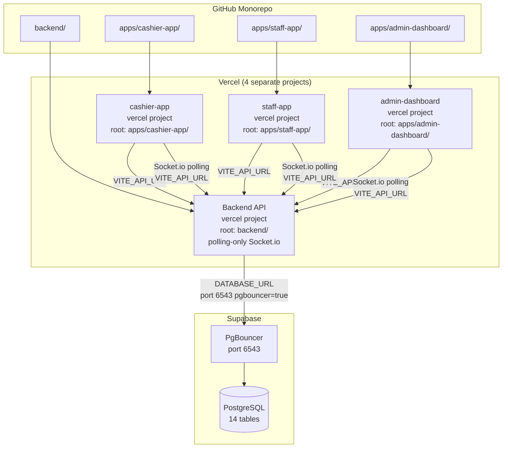

# Design Document: Supabase + Vercel Migration

## Overview

This document describes the technical design for migrating JJIKGO-STUDIO from Railway (Express.js + PostgreSQL) to Supabase (hosted Postgres) and Vercel (serverless). The migration is purely infrastructural — no business logic, query logic, or auth system changes. The three frontend apps (cashier-app, staff-app, admin-dashboard) are already on Vercel and will continue to work after the backend migration.

The entire stack uses only three services: **Supabase** (database), **Vercel** (backend + all 3 frontends), and **GitHub** (source control / CI).

The key challenge is that Vercel's serverless runtime does not support persistent WebSocket connections. The design addresses this by configuring Socket.io to use **HTTP long-polling only** (`transports: ['polling']`), which is fully compatible with Vercel serverless functions. Real-time updates will have slightly higher latency (~1–2s) compared to WebSockets, but will work correctly without any additional hosting service.

## Architecture



### Socket.io on Vercel — Design Decision

Vercel serverless functions are stateless and short-lived. WebSocket connections require a persistent TCP connection, which serverless cannot provide. The solution is to configure Socket.io to use **HTTP long-polling only**:

- Socket.io server: `transports: ['polling']`
- Socket.io clients: `transports: ['polling']`
- Vercel function `maxDuration: 60`

Long-polling works by the client making repeated HTTP requests that the server holds open until an event occurs (or a timeout). Each poll is a standard HTTP request, fully compatible with serverless. The trade-off is ~1–2s additional latency vs WebSockets, which is acceptable for queue update notifications.

This eliminates the need for a separate Socket.io deployment on Railway or Render. All four Vercel projects connect to the same backend URL via `VITE_API_URL`. There is no `VITE_SOCKET_URL`.

## Components and Interfaces

### 1. `backend/api/index.js` — Vercel Serverless Entry

Exports the Express `app` as the default export. Vercel's Node.js runtime calls this as a serverless function. The `app.js` must not call `server.listen()` when imported as a module — it should only start listening when run directly.

```js
// backend/api/index.js
const app = require('../src/app');
module.exports = app;
```

### 2. `backend/vercel.json` — Vercel Routing Config

Routes all HTTP traffic to the serverless entry point. `maxDuration: 60` is required to support Socket.io long-polling connections, which can hold open for up to 25–30s per poll cycle.

```json
{
  "version": 2,
  "functions": {
    "api/index.js": { "maxDuration": 60 }
  },
  "routes": [
    { "src": "/(.*)", "dest": "/api/index.js" }
  ]
}
```

### 3. `backend/src/app.js` — Refactored Express App

The current `app.js` calls `startServer()` unconditionally at module load time. This must be changed so that `server.listen()` is only called when the file is run directly (not when imported by `api/index.js`).

Socket.io is attached to the HTTP server with `transports: ['polling']` only:

```js
const io = new Server(server, {
  transports: ['polling'],
  cors: { origin: corsOriginFn, credentials: true }
});
```

The `startServer()` call is guarded:

```js
if (require.main === module) {
  startServer();
}

module.exports = app;
```

### 4. `backend/src/config/db.js` — Supabase Connection

Updated to pass `prepare: false` and `max: 1` when using PgBouncer (required for transaction-mode pooling). PgBouncer in transaction mode does not support prepared statements.

```js
const isPgBouncer = env.DATABASE_URL?.includes('pgbouncer=true');
queryClient = postgres(env.DATABASE_URL, {
  prepare: !isPgBouncer,
  max: isPgBouncer ? 1 : 10,
});
```

### 5. `backend/src/socket/index.js` — Socket.io Server Config

Updated to restrict transports to polling only:

```js
// In app.js when creating the Server:
const io = new Server(server, {
  transports: ['polling'],
  cors: { ... }
});
```

The `setupSocket`, `emitQueueUpdate`, `emitPrintRequest`, and `emitToAdmin` functions in `socket/index.js` remain unchanged — they are transport-agnostic.

### 6. Frontend `api.js` files — Socket.io Client Config

All three frontend apps must configure their Socket.io client to use polling only, and connect to `VITE_API_URL` (no separate socket URL):

**cashier-app and staff-app** (`src/utils/api.js`):
```js
export const socket = io(API_URL, {
  transports: ['polling'],
  withCredentials: true,
});
```

**admin-dashboard** (`src/utils/socket.js` or `api.js`):
```js
export const socket = io(API_URL, {
  transports: ['polling'],
  withCredentials: true,
});
```

The Railway fallback URL in all three `api.js` files must be removed.

### 7. Frontend `vercel.json` files

All three frontend apps already have correct `vercel.json` with SPA rewrites. No changes needed to the rewrite rules.

### 8. Root `.gitignore`

Monorepo-level gitignore covering all subdirectories: `node_modules/`, `dist/`, `.env`, `.env.local`.

### 9. Root `README.md`

Deployment guide covering: repo structure, Vercel project setup per app, environment variables, Supabase setup, and Socket.io polling configuration.

## Data Models

No schema changes. All 14 tables remain identical. The only change is the connection string.

```
Branch, User, auth_sessions, Theme, Package, Addon, CafeSnack,
Promo, Shift, Expense, Booth, Transaction, Queue, Setting
```

### Connection String Formats

| Use Case | Format | Port |
|---|---|---|
| Vercel serverless (REST API + Socket.io) | `postgresql://...?pgbouncer=true` | 6543 |
| Local development | `postgresql://...` | 5432 |
| Drizzle db:push / db:studio | `postgresql://...` | 5432 (direct) |

> Note: `db:push` must use the **direct** connection (port 5432), not the pooled URL, because Drizzle migrations use prepared statements incompatible with PgBouncer transaction mode.

### Environment Variables per Deployment

**Backend (Vercel)**:
```
DATABASE_URL=postgresql://...@aws-0-*.pooler.supabase.com:6543/postgres?pgbouncer=true
JWT_SECRET=<secret>
NODE_ENV=production
FRONTEND_URLS=https://cashier.vercel.app,https://staff.vercel.app,https://admin.vercel.app
```

**cashier-app / staff-app / admin-dashboard (Vercel)**:
```
VITE_API_URL=https://<backend>.vercel.app
```

No `VITE_SOCKET_URL` — Socket.io connects to the same `VITE_API_URL` as the REST API.

## Correctness Properties

*A property is a characteristic or behavior that should hold true across all valid executions of a system — essentially, a formal statement about what the system should do. Properties serve as the bridge between human-readable specifications and machine-verifiable correctness guarantees.*

### Property 1: Drizzle schema round-trip

*For any* valid record inserted via Drizzle ORM into Supabase Postgres, reading it back by primary key should return an equivalent record with all fields intact.

**Validates: Requirements 1.2, 1.5**

### Property 2: API routes respond via serverless entry

*For any* API route registered in `app.js`, when `DATABASE_URL` is set to a valid Supabase connection string, the serverless entry exported from `backend/api/index.js` should handle the request and return a non-5xx response for a valid authenticated request.

**Validates: Requirements 2.3, 3.3**

### Property 3: PgBouncer mode disables prepared statements

*For any* `DATABASE_URL` containing `pgbouncer=true`, the `postgres` driver should be initialized with `prepare: false` and `max: 1` to prevent connection exhaustion and prepared statement errors under PgBouncer transaction-mode pooling.

**Validates: Requirements 2.5, 7.5**

### Property 4: Socket.io branch room isolation

*For any* two distinct branch IDs, a `queueUpdated` event emitted to `room:branch_A` should be received only by sockets in `room:branch_A` and `room:admin`, and not by sockets in `room:branch_B`.

**Validates: Requirements 4.1, 4.2**

### Property 5: CORS accepts all configured frontend origins

*For any* of the three configured frontend Vercel URLs passed as the `origin` to the backend CORS handler or the Socket.io CORS handler, the handler should return that origin (not null/false).

**Validates: Requirements 4.4, 9.1, 9.2**

### Property 6: No secrets in committed files

*For any* file tracked by git in the repository, it should not contain patterns matching known secret formats (e.g., `postgresql://.*:.*@`, `JWT_SECRET=`, `DATABASE_URL=` with a value).

**Validates: Requirements 5.4**

### Property 7: VITE_API_URL has no trailing slash

*For any* value assigned to `VITE_API_URL`, the API base URL used in frontend `api.js` utilities should not end with `/`.

**Validates: Requirements 7.3**

### Property 8: Auth session round-trip

*For any* valid user credentials, logging in should create a record in `auth_sessions`, and subsequently sending the returned token in the `Authorization: Bearer` header should result in the backend accepting the request (not returning 401).

**Validates: Requirements 8.1, 8.2, 8.3**

## Error Handling

### Missing DATABASE_URL at startup
The backend logs a warning and continues booting. Routes that hit the database will return 500. This allows the health check (`/health`) to still respond, which is important for Vercel's deployment health checks.

### PgBouncer prepared statement errors
If `DATABASE_URL` contains `pgbouncer=true` but `prepare: false` is not set, Postgres will throw `ERROR: prepared statement "..." already exists`. The `db.js` config detects the `pgbouncer=true` query param and sets `prepare: false` automatically.

### Vercel cold starts and connection exhaustion
Serverless functions can spawn many concurrent instances, each opening a new DB connection. Using PgBouncer (port 6543) with `max: 1` per function instance prevents exhausting Supabase's connection limit. Supabase free tier allows 60 direct connections; PgBouncer pools these efficiently.

### Socket.io polling on Vercel
Long-polling requires `maxDuration: 60` in `vercel.json` to prevent Vercel from terminating the function before the poll cycle completes. If `maxDuration` is not set, clients will see frequent disconnects. The Socket.io client should be configured with `reconnection: true` (default) to handle any serverless cold-start gaps.

### CORS errors
The backend CORS handler currently allows all origins (`callback(null, origin || true)`). For production, `FRONTEND_URLS` should be used to restrict origins. The design keeps the current permissive behavior but documents that `FRONTEND_URLS` should be set correctly on Vercel.

### Railway fallback URL removal
The current `api.js` files in all three frontends contain a hardcoded Railway fallback URL (`https://backend-production-d3fc.up.railway.app`). This must be removed. If `VITE_API_URL` is not set, the fallback should be `http://localhost:3000` only.

## Testing Strategy

### Unit Tests

Focus on specific examples and edge cases:

- `db.js` initializes with `prepare: false` and `max: 1` when `DATABASE_URL` contains `pgbouncer=true`
- `db.js` initializes with `prepare: true` when `DATABASE_URL` does not contain `pgbouncer=true`
- `env.js` falls back to `http://localhost:3000` when `VITE_API_URL` is not set
- `/health` endpoint returns 200 with `status: "Live"`
- `backend/api/index.js` exports a function (not undefined)
- `drizzle.config.js` reads `DATABASE_URL` from environment (no hardcoded credentials)
- Auth system does not import `@supabase/supabase-js`
- Each frontend `vercel.json` contains the SPA rewrite rule
- Root `.gitignore` contains `node_modules/`, `dist/`, `.env`, `.env.local`
- No frontend `api.js` file contains the hardcoded Railway URL
- `app.js` does not call `server.listen()` when imported as a module (only when `require.main === module`)

### Property-Based Tests

Use [fast-check](https://github.com/dubzzz/fast-check) for Node.js property-based testing. Each test runs a minimum of 100 iterations.

**Property 1: Drizzle schema round-trip**
```js
// Feature: supabase-vercel-migration, Property 1: Drizzle schema round-trip
fc.assert(fc.asyncProperty(
  fc.record({ name: fc.string({ minLength: 1 }), location: fc.string() }),
  async (branchData) => {
    const [inserted] = await db.insert(branches).values(branchData).returning();
    const [fetched] = await db.select().from(branches).where(eq(branches.id, inserted.id));
    return fetched.name === inserted.name && fetched.location === inserted.location;
  }
), { numRuns: 100 });
```

**Property 3: PgBouncer mode disables prepared statements**
```js
// Feature: supabase-vercel-migration, Property 3: PgBouncer mode disables prepared statements
fc.assert(fc.property(
  fc.string({ minLength: 1 }).map(host => `postgresql://user:pass@${host}:6543/db?pgbouncer=true`),
  (url) => {
    const config = buildPostgresConfig(url);
    return config.prepare === false && config.max === 1;
  }
), { numRuns: 100 });
```

**Property 4: Socket.io branch room isolation**
```js
// Feature: supabase-vercel-migration, Property 4: Socket.io branch room isolation
fc.assert(fc.asyncProperty(
  fc.integer({ min: 1, max: 9999 }), fc.integer({ min: 1, max: 9999 }),
  async (branchA, branchB) => {
    fc.pre(branchA !== branchB);
    // connect two sockets to different branch rooms, emit to branchA, verify branchB doesn't receive
    // both sockets use transports: ['polling']
  }
), { numRuns: 100 });
```

**Property 5: CORS accepts all configured frontend origins**
```js
// Feature: supabase-vercel-migration, Property 5: CORS accepts all configured frontend origins
fc.assert(fc.property(
  fc.constantFrom(...FRONTEND_URLS),
  (origin) => {
    let result;
    corsOriginFn(origin, (err, val) => { result = val; });
    return result === origin;
  }
), { numRuns: 100 });
```

**Property 7: VITE_API_URL has no trailing slash**
```js
// Feature: supabase-vercel-migration, Property 7: VITE_API_URL has no trailing slash
fc.assert(fc.property(
  fc.webUrl().map(url => url + '/'),
  (urlWithSlash) => {
    const normalized = urlWithSlash.replace(/\/$/, '') || 'http://localhost:3000';
    return !normalized.endsWith('/');
  }
), { numRuns: 100 });
```

**Property 8: Auth session round-trip**
```js
// Feature: supabase-vercel-migration, Property 8: Auth session round-trip
fc.assert(fc.asyncProperty(
  fc.record({
    username: fc.string({ minLength: 3, maxLength: 20 }),
    password: fc.string({ minLength: 6 })
  }),
  async (creds) => {
    // create user, login, use returned token in Authorization header, verify 200
  }
), { numRuns: 100 });
```

### Integration Tests

After deploying to Vercel + Supabase:
1. Run `npm run db:push` against Supabase direct URL (port 5432) — verify exit 0
2. Hit `/health` on the Vercel deployment — verify `{ status: "Live" }`
3. Login via cashier-app — verify JWT returned and session in `auth_sessions`
4. Create a transaction — verify it appears in Supabase dashboard
5. Connect Socket.io client with `transports: ['polling']` to the Vercel backend URL — verify `queueUpdated` received on queue change
6. Verify no WebSocket upgrade attempts appear in Vercel function logs
